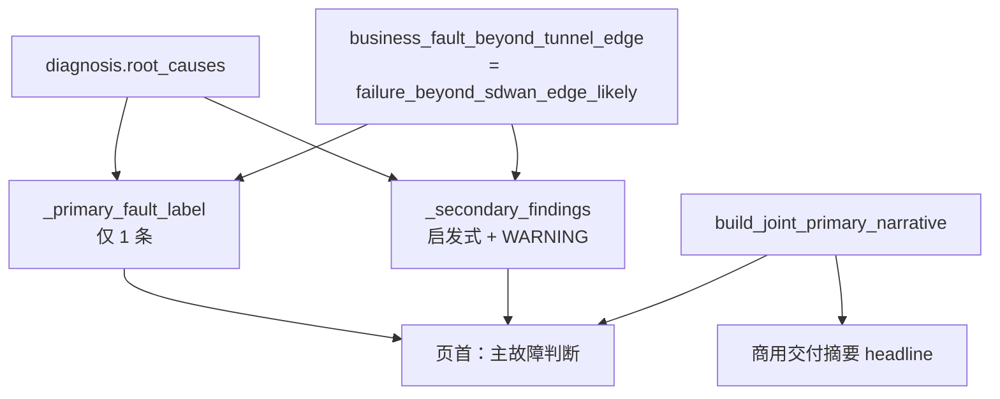

# joint_report_probe_outcome

- **对应源码**: `src/sdwan_desktop/services/reporter/joint_report_probe_outcome.py`
- **最近更新**: 2026-05-16 — `_summarize_row` 将 `status=ok` 且 `port_open=false` 计为 TCP 失败，与 `_infer_business_failure_stage` / `_business_probe_rows_all_ok` 一致；`phenomenon` 在 `overall=ok` 时亦填充；`deep_dive_joint_ux` 页首两行（现象/主判断）始终占位。
- **关联规范**:
  - [`spec/detail_function_design.md`](../../../../../../spec/detail_function_design.md) §2.2.2、§2.3
  - [`docs/rules/product_features/raisecom_msg5200b_network_analysis.md`](../../../../../../docs/rules/product_features/raisecom_msg5200b_network_analysis.md)

## 职责概述

业务联合诊断报告（联合场景 HTML 为 `deep_dive_joint_ux.html`，纯深度诊断为 `deep_dive.html`）页首 hero 区结论块的载荷构建。读者画像为「运维 / 略懂网络」，要求 30 秒内能复述：测了什么、哪一步失败、**主故障在哪一段**、下一步查什么。

## 单一主因 + 待核对的分层模型

| 条件 | `primary_fault` | `secondary_findings` |
|------|-----------------|----------------------|
| `beyond_tunnel_edge=True` + BIZ-TCP 失败 | `公网/对端路径不可达`（唯一） | CPE-003/CPE-004 → 「待核对」+ 配置静态比对说明 |
| `beyond_tunnel_edge=False` + BIZ-TCP 失败 | `服务器不可达` | CPE-003/CPE-004 仍以「待核对」呈现，不进入主因 |
| `failure_stage=dns` | `DNS 解析失败` | — |
| `failure_stage=server_port` | `服务器端口不可达` | — |
| 仅 `CPE-001` | `CPE 不可达` | — |
| 业务探测全 OK | 空字符串 | —；`phenomenon` 明示 DNS/TCP 已通过（与折叠区 `overall` 一致） |

## 关键不变量

1. **`primary_fault` 永远单值**：模板中不再用「；」拼接多个并列主因；`fault_summary` 与 `fault_causes` 兼容字段也只承载主因。
2. **`beyond_tunnel_edge=True` 时启发式 ID 永不上升**：`CPE-003` / `CPE-004` / `CPE-002-WARN` 等通过 `_HEURISTIC_FINDING_TEMPLATE` 进入 `secondary_findings`，配文案明确「静态比对，需结合 conntrack 源核对」。与 [`_annotate_problem_nodes`](../../../interface/cli/commands/business_diagnose.md) 的 `suppress_heuristic` 路径同源，避免拓扑不标红 CPE / 但页首仍写「CPE 配置异常」的矛盾。
3. **`primary_narrative` 与商用交付摘要 `headline` 字符串级一致**：通过调用 [`joint_commercial_delivery.build_joint_primary_narrative`](joint_commercial_delivery.md) 共享决策。
4. **`ruled_out` 仅写有证据的弱否定项**：DNS 正常 / 隧道对端 ICMP 正常 / conntrack 有命中 / 报文已离开 CPE 邻域；不写空话，不重复主因。
5. **TCP 成功口径**：与 `business_diagnose._infer_business_failure_stage` 一致，`status=ok` 但 `data.port_open is False`（RST/拒绝）视为失败，禁止页首写「探测通过」。

## 字段速查

| 字段 | 含义 |
|------|------|
| `targets`, `targets_line` | 声明业务目标（host:port 数组与一行展示） |
| `methods`, `methods_line` | 探测方法（DNS A / tcping / Traceroute） |
| `results` | 每目标 DNS/TCP/Traceroute 状态与简短明细（详情折叠展示） |
| `overall` | `ok`/`fail`/`partial`/`unknown` |
| `result_line` | 整体探测一句话 |
| `phenomenon` | 现象一句话（域名 / TCP 形态摘要） |
| `primary_fault` | **单一**主因标签 |
| `primary_narrative` | 主叙述段落 |
| `ruled_out` | 已排除项列表 |
| `secondary_findings` | 待核对项 `[{id,label,note}]` |
| `fault_causes`, `fault_summary` | 历史兼容字段，均派生自 `primary_fault`，不再含分号拼接 |

## 调用点

- `interface/cli/commands/business_diagnose.py::_write_joint_deep_dive_style_report`：注入 `topology.report_joint_probe_outcome`。
- `reporting/templates/deep_dive_joint_ux.html`（`_joint_ux` 分支）：联合场景专用；hero 顺序为现象→主因→已排除→主叙述→待核对（`details` 默认折叠）；探测明细仍在 `
`。

## 单元测试

`tests/unit/services/reporter/test_joint_report_probe_outcome.py` 覆盖：

1. `test_tiktok_beyond_tunnel_primary_fault_is_singular_remote` — 181552 类场景：主因唯一、无 CPE/NAT 并列、`ruled_out` 含 DNS/隧道/conntrack/CPE 邻域。
2. `test_primary_fault_cpe_unreachable_overrides_remote` — CPE-001 优先。
3. `test_primary_fault_dns_when_failure_stage_dns` — DNS 阶段失败。
4. `test_primary_fault_in_domain_tcp_failure` — `beyond=False` 时主因为「服务器不可达」，CPE-003 仍仅为待核对。
5. `test_tcp_ok_but_port_closed_is_fail_phenomenon_not_probe_pass` — `port_open=false` 时现象行不写「探测通过」。
6. `test_no_primary_fault_when_all_business_probes_ok` — 全通时 `phenomenon` 含「DNS/TCP 探测通过」。
7. `test_primary_narrative_aligned_with_delivery_when_tunnel_ping_fail` — 页首 `primary_narrative` 与商用交付 `headline` 字符串级一致。
