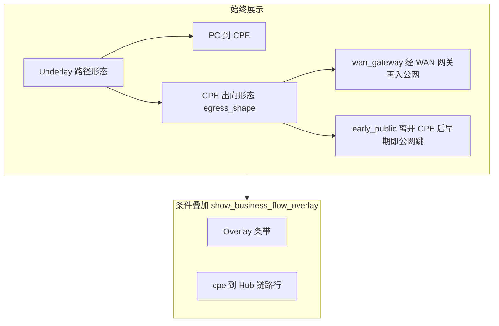

# 三条功能流：产品定位与核心理念

> **定位**：**项目规则库**（跨厂商、跨型号）。实现或修改 `quick-check`、`deep-dive`、`business-diagnose` 任一流程及其联合报告前**必读**。  
> **与产品库关系**：厂商/型号专有转发与门控逻辑见 [`product_features/`](product_features/INDEX.md)；**禁止**将 5200B 会话规则默认套用到其他 CPE。

---

## 1. 三条功能流分工

| 功能流 | 诊断中心 | 用户核心诉求 | 结论风格 |
|--------|----------|--------------|----------|
| **business-diagnose**（`sdwan-business-diagnose`） | 用户**声明的业务目标**（`-b` 域名/IP） | **该业务**的流走向 + **故障根因**（若存在） | 能精确定位则精确定位；只能启发式则**明确标注「可能」**；**禁止**用隐藏 UI 代替未证实的判断 |
| **quick-check**（`sdwan-quick-check`） | **环境**（PC 侧） | 环境健康度 + 初步异常线索 | 体检式摘要，不绑定单一声明业务流 |
| **deep-dive**（`sdwan-deep-dive`） | **环境**（PC + CPE 全量） | 全配置解析 + **全部**业务链路/隧道/策略库存 | 全量盘点与 Overlay 专检，**不以**声明业务流门控替代 |

**强制边界**：

- business-diagnose **不是** deep-dive 的「只跑一个域名」子集；二者报告骨架可复用，但**呈现门控与信息密度**不同（见 §3、§4）。
- quick-check / deep-dive **不得**承担「声明业务是否走 Overlay」的 definitive 门控；该职责在 business-diagnose + 对应产品门控文档。

---

## 2. business-diagnose：以业务流走向为中心

### 2.1 诊断对象

- 输入：**声明业务目标**（CLI `-b` / 配置中的业务域名或 IP）。
- 输出优先级：
  1. **业务流走向**（Underlay 路径形态 + 条件性 Overlay 叠加）；
  2. **根因**（探测失败、策略未命中、隧道异常等，按证据链推导）；
  3. **已排除项**（弱化措辞，避免「已排除」与仍展示旁证矛盾）。

### 2.2 精确定位 vs 启发式（均须可见）

| 类型 | 含义 | 报告要求 |
|------|------|----------|
| **精确定位** | 会话/策略/跳表等多源证据一致，可断言走或未走声明路径 | 页首/路径说明可用 **【精确定位】** 前缀；拓扑按门控展示对应条带 |
| **启发式** | 部分证据支持，存在未观测或 PC↔策略源不一致 | 页首/路径说明须用 **【启发式】** 或 **「可能」**；**禁止**写成确定事实 |
| **未证实** | 采样失败或证据不足以绑定 Overlay | **不叠加** Overlay 条带与 cpe→hub 链路行；Underlay 叙述仍保留 |

**禁止**：为「界面简洁」而删除影响判断的信息；简洁化仅作用于**结论区排版**（见 [`BUSINESS_DIAGNOSE_REPORT_UX.md`](BUSINESS_DIAGNOSE_REPORT_UX.md)），证据放入折叠/证据链。

### 2.3 与 deep-dive 的边界

| 维度 | business-diagnose | deep-dive |
|------|-------------------|-----------|
| url-group / ipset | 与**声明域**相关的节选 + 门控叙述 | 全量列表与专检 |
| 隧道 / Hub | **门控为真**时展示 cpe→hub + Overlay 条带 | 库存表 + 全链路探测 |
| 根因卡片 | 与声明业务相关 | 可含环境与全业务 |

---

## 3. 分层拓扑呈现（跨厂商）

Overlay **依托** Underlay；报告拓扑须**分层**表达，而非二选一隐藏。

| 层级 | 字段（实现侧） | 展示规则 |
|------|----------------|----------|
| **Underlay** | `egress_shape`、`datapath_banner` Underlay 段 | **始终**在路径实证/拓扑主区保留一句路径形态 |
| **Overlay + cpe→hub** | `show_business_flow_overlay`（与 `show_overlay_tunnel_strip` 同源） | **同时为真或同时为假**：展示 Overlay 示意条 **且** 链路一览/节点表中的 tunnel/hub 行；为假时**不叠加**，但 Underlay 叙述仍在 |

**禁止**：

- deep-dive 式「隐藏 Overlay 条带但链路表仍显示 tunnel 行」；
- 用「verify 通过」单独隐藏 tunnel 行而与 Overlay 门控脱钩（verify 通过时 Underlay 仍说明路径，但不标红 CPE/Hub）。

---

## 4. 证据与结论分工（项目级）

| 区域 | 原则 |
|------|------|
| **采集与证据链** | **完整**：conntrack 原始行、策略/ipset 节选、探测命令输出、跳表等须可下钻 |
| **页首结论 / 交付摘要 / 路径实证首屏** | **简洁**：现象 + 主故障或「无故障」+ 一至两句；技术明细默认折叠 |
| **启发式长说明** | 放在根因卡片、证据链、折叠块内，**不**堆在页首 |

详见 [`BUSINESS_DIAGNOSE_REPORT_UX.md`](BUSINESS_DIAGNOSE_REPORT_UX.md)。

---

## 5. 厂商专有逻辑（代码与文档分离）

| 范围 | 存放位置 | 代码入口 |
|------|----------|----------|
| 跨厂商呈现、三条流分工、分层拓扑 | 本文 + `BUSINESS_DIAGNOSE_REPORT_UX.md` | `topology_joint_presentation.py` 等**只读** gate 字段 |
| Raisecom 5200B 会话/url-group 门控 | [`raisecom_msg5200b_business_joint_gate.md`](product_features/raisecom_msg5200b_business_joint_gate.md) | `raisecom_msg5200b_session.py`（规划拆至 `raisecom_msg5200b_business_gate.py`） |
| 非 5200B | 同上专章「非 5200B 回退」 | `compute_joint_overlay_datapath_gate` 中 `non_raisecom_*` 分支 |

**开发自检**（改 business 联合报告前）：

1. 已读本文 + `BUSINESS_DIAGNOSE_REPORT_UX.md`；
2. 若触及 CPE 会话门控，已确认 `is_raisecom_msg5200b_cpe()` 分支，且未在 presentation 层写 5200B 专有 if；
3. `show_business_flow_overlay` 同时驱动 Overlay 条带与 cpe→hub 链路行。

---

## 6. 相关文档

| 文档 | 用途 |
|------|------|
| [`BUSINESS_DIAGNOSE_REPORT_UX.md`](BUSINESS_DIAGNOSE_REPORT_UX.md) | 联合 HTML 分区简洁/完整表 |
| [`docs/rules/INDEX.md`](INDEX.md) | 规则库总索引 |
| [`docs/implementation/FLOW_business_diagnose.md`](../implementation/FLOW_business_diagnose.md) | 实现层步骤与 metadata 键 |
| [`.cursor/AI_SPEC_GUIDE.md`](../../.cursor/AI_SPEC_GUIDE.md) | Agent 查阅协议与三条流自检 |

---

## 7. 文档维护

- 三条流行为变更时，**同步**更新本文、`FLOW_business_diagnose.md` 与 `AI_SPEC_GUIDE.md` 查阅表。
- 新增厂商门控时，在 `product_features/` 新建 **{vendor}_business_joint_gate.md**，**不得**扩写本文为厂商细则。
