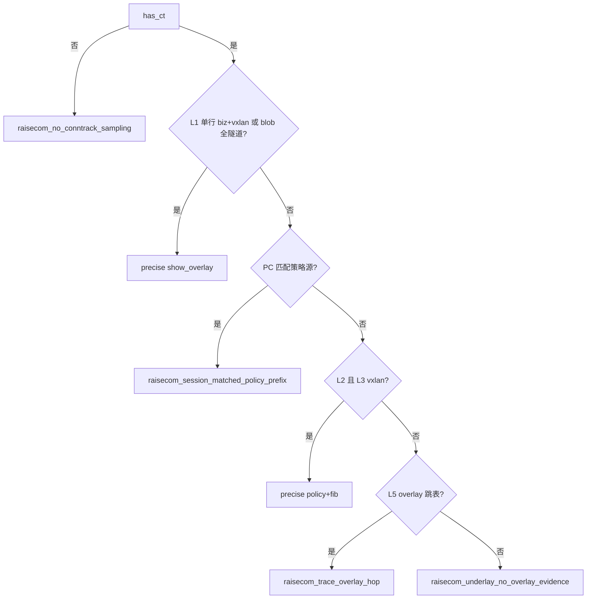

# Raisecom MSG5200B：business-diagnose 路径证据与门控（5200B-only）

> **适用范围**：`is_raisecom_msg5200b_cpe(cpe) == True` 时的 **business-diagnose 联合报告** 路径判断与 Overlay 呈现门控。  
> **禁止**：在 non-5200B 分支引用本文；其他型号须单独 `{vendor}_business_joint_gate.md`。  
> **配置与转发背景**：[`raisecom_msg5200b_network_analysis.md`](raisecom_msg5200b_network_analysis.md) §1–§5。  
> **采集模板**：[`templates/whole_config_5200b.txt`](../../../templates/whole_config_5200b.txt)（含 `show ip route`、`diagnose:ip rule`、table 99/100、`ipset`、`iptables mangle` 等）。  
> **实现（规划/落地）**：`raisecom_msg5200b_session_path.py`（L1）、`raisecom_msg5200b_mangle_evidence.py`（L2 mangle/ip rule）、`raisecom_msg5200b_fib_evidence.py`（L3）、`raisecom_msg5200b_path_verdict.py`（Overlay 门控聚合）、`raisecom_msg5200b_declared_path_analysis.py`（声明路径单一事实源）；入口 `joint_overlay_datapath_gate.py` / `business_diagnose` CLI。

**版本说明**：本文 **废除** 原「D0 全部 DIP 公网硬否决」；改按 **证据分层 L0–L5** 聚合 `evidence_tier` 与 `show_business_flow_overlay`。历史 `rule_case` 前缀 `raisecom_` 保留，新增以 `raisecom_overlay_*` / `raisecom_underlay_*` 为主。

---

## 1. 呈现契约（输出字段）

门控结果 `JointOverlayDatapathGate` 驱动 presentation **只读**字段（禁止在模板/delivery 再写 5200B 专有 if）：

| 字段 | 含义 |
|------|------|
| `show_overlay_tunnel_strip` / `show_business_flow_overlay` | 是否展示 Overlay 条带 **且** cpe→hub 链路行（同源） |
| `overlay_evidence_positive` | 是否保留隧道类正向证据 |
| `evidence_tier` | `precise` / `heuristic` / `underlay_only` |
| `rule_case` | 判定分支 id |
| `datapath_banner` | 路径实证（简洁，见 [`BUSINESS_DIAGNOSE_REPORT_UX.md`](../BUSINESS_DIAGNOSE_REPORT_UX.md)） |
| `joint_overlay_topology_note` | 拓扑注记 |
| `egress_shape` | Underlay 形态旁证（`wan_gateway` / `early_public`） |
| `url_group_supplement` | url-group 多组优先级 **叙述补充**（不可单独打开 Overlay） |
| `presentation_suppress_detail` | 不展示 Overlay 时的 **规则对齐** 说明（替代泛化「策略源未匹配且启发式不足」） |

报告 **证据链**（折叠区）应分层展示 L1–L5 节选，见 UX 专章。

---

## 2. 证据分层（L0–L5）

**原则**：各层独立产出旁证；**必要时分层采纳**；门控只做 tier 聚合。  
**禁止**：用「业务目的 IP 是否为公网」否定 L1 同行 vxlan 回程结论。

| 层 | 数据源（CLI / 诊断视图） | 回答问题 | 纳入门控 |
|----|-------------------------|----------|----------|
| **L0** | PC `targeted_probe`（DNS/TCP/traceroute） | 声明业务在本机是否可达 | 失败则不讨论 CPE Overlay |
| **L1 会话** | `diagnose:nf_conntrack grep <biz_ip>` | 流是否经本 CPE；回程是否 vxlan/隧道 | **主路径** |
| **L2 策略面** | `diagnose:ipset --list`、`diagnose:ip rule show`、`diagnose:iptables -t mangle -nvL`、CFG `security-ip` | 业务 IP 是否在 url 白名单；源是否允许；PREROUTING MARK 计数；fwmark→表 | 与 L3 组合 precise；**声明路径对账**见 §11 |
| **L3 FIB** | `show ip route`、`diagnose:ip route table 99/100` | 对 `biz_ip` 的出接口/表 | 与 L2 组合或 L1 未命中时 heuristic |
| **L4 接口/链路** | `show interface`、`show arp`、`show link-protect` | 口 up、主备、PC 附着 | heuristic 补充 |
| **L5 路径** | PC traceroute | 跳表是否经 overlay 邻接 | heuristic |

### 2.1 L1 — nf_conntrack 双向五元组（精确定位主路径）

Raisecom 一行含 **正向 + 回程** 两组 `src/dst`（不存在「只有 src 无 dst」）。

**示例（现网形态）**：

```text
TIME_WAIT src=10.10.25.3 dst=172.253.118.91 ... src=172.253.118.91 dst=8.1.3.2 ...
         └─ 正向（NAT 后 src）──────┘     └─ 回程 dst=vxlan5 口 ──┘
```

**单行成立条件**（`line_overlay_confirmed`）：

1. **正向** `dst` ∈ `biz_target_ips`（声明业务探测解析出的目的 IP 集合）；
2. **回程** `src` 或 `dst` 命中 **vxlan 逻辑口 IP**（`cpe.interfaces` 中名称含 `vxlan` 的 `ip_address`，如 `8.1.3.2`）**或** 隧道/overlay 下一跳集（§4）。

**NAT**：**不要求**正向 `src` = PC 快照；上游 Router SNAT 时正向 `src` 常为 CPE 侧可见私网地址。

**整段 blob 兜底**（原 D2，解析粒度为 **grep 块内全部 `dst=`**）：

- `policy_src_mismatch`（PC 未匹配任一 SD-WAN 策略 `source` 前缀）**且**
- 采样中 **全部** `dst` ∈ §4 隧道/overlay 下一跳集。

**废除**：「全部 DIP 为公网 → 禁止 Overlay」（原 D0）。

| rule_case | tier | show_overlay |
|-----------|------|:------------:|
| `raisecom_overlay_conntrack_bidirectional` | precise | T |
| `raisecom_all_dip_tunnel_precise` | precise | T |

### 2.2 L2 — 策略面

命中链（与模板一致）：**源白名单 ∧ 目的∈url 解析集 → MARK → ip rule → table 99/100 默认 dev vxlan\***。

- **不得**仅凭 `show url-group all domain` 列表打开 Overlay。
- 多 url-group 时按 **priority** 与 **mangle PREROUTING 顺序**（`liveBroadcast` 优先于 `acceleratePlus`）— 见 network_analysis §4.2。
- `iptables -t mangle -nvL`：在 **PREROUTING** 链解析 `MARK set 0xNN` 行及 **pkts** 计数；期望 MARK 来自生效 url-group（`acceleratePlus`→`0x66`/`99`，`liveBroadcast`→`0x67`/`100`，与 network_analysis §3–4 一致）。
- **security-ip 未命中**时不得单独因 mangle 零计数判 mismatch（链未进入该组 MARK 规则）；见 §11 `break_point`。

### 2.3 L3 — FIB

- 对 `biz_target_ips`：最长前缀 / 默认路由 → `(table_id, egress_dev, next_hop)`。
- `biz_ip` 落在 ipset → 推断 fwmark → 查 table 99/100 默认是否 `dev vxlan*`。
- **无** `ip route get`：由 main + policy 表组合推断（见 `planner.py` 注释）。

| 条件 | tier | show_overlay |
|------|------|:------------:|
| L1 未成立；L2 命中 **且** L3 `egress_dev` 匹配 `vxlan*` | precise | T |
| 仅 L3 指向 vxlan，无 L1/L2 | heuristic | T（须标注依据层） |
| L3 仅 main/ge1，无 L1/L2 overlay 旁证 | underlay_only | F |

### 2.4 L4 / L5 — 启发式

| 条件 | rule_case | tier |
|------|-----------|------|
| L1–L3 未达 precise；traceroute 命中 §4 扩展 overlay 邻接集 | `raisecom_trace_overlay_hop` | heuristic |
| 有会话但无 overlay 旁证 | `raisecom_underlay_no_overlay_evidence` | underlay_only |

**跳表地址集**：`tunnel_set` ∪ vxlan 口 IP ∪ FIB `via`/`connected`（**含** vxlan 段网关如 `8.1.3.1`，**禁止**未分类标为 WAN 公网）。

### 2.5 L0 / 无会话

| 条件 | rule_case | show_overlay |
|------|-----------|:------------:|
| `has_ct == false` | `raisecom_no_conntrack_sampling` | F |
| PC 探测失败 | （根因卡，非本门控） | F |

### 2.6 D1 保留语义（策略源匹配）

| 条件 | rule_case | tier |
|------|-----------|------|
| `has_ct` 且 `pc_matches_sdwan_policy_source_prefix`（**在 L1 未短路之后**仍可作为分支） | `raisecom_session_matched_policy_prefix` | precise |

**顺序**：L1 优先于 D1；**禁止** D0 类公网 DIP 拦截排在 L1 之前。

---

## 3. 判定流程（实现顺序）



---

## 4. 隧道 / Overlay 地址集

与 [`raisecom_msg5200b_network_analysis.md`](raisecom_msg5200b_network_analysis.md) §2 一致：

- 默认下一跳：`5.96.1.26`, `5.100.1.18`, `5.96.1.198`, `5.100.1.174`
- 外加 `cpe.vpn_tunnels[].remote_ip`
- **vxlan 逻辑口 IP**（如 `8.1.3.2`）来自 `cpe.interfaces`，**不一定**在上一列表中

代码：`tunnel_peer_and_overlay_address_set()` + `vxlan_logical_iface_ipv4_set()`。

---

## 5. NAT 与 PC 源（与 delivery 对齐）

- PC→Router(NAT)→CPE：CPE conntrack **常见**无 `src=PC`；**不得**据此单独判定策略未生效。
- `upstream_nat_likely`（本机探测 OK + 有会话 + 未见 PC 为 src）→ **报告 INFO**，不参与 L1 布尔必要条件。
- L1 **主路径**为同行「正向 dst=业务 IP + 回程 vxlan 口」，与 NAT 不冲突。

---

## 6. egress_shape（Underlay 旁证）

| 值 | 含义 |
|----|------|
| `wan_gateway` | 经 WAN 网关再入公网 |
| `early_public` | 离开 CPE 后早期即为公网跳 |

**不改变** L1 的 `show_overlay`；仅丰富 Underlay 叙述。

---

## 7. 非 5200B 回退

| 条件 | show_overlay | rule_case |
|------|:------------:|-----------|
| traceroute 命中 overlay 集 | T | `non_raisecom_trace_overlay_hop` |
| 其余 | F | `non_raisecom_no_overlay_evidence` |

---

## 8. 采集与证据链归档

| 命令 | 主采集/拓扑后 | 对应层 | 备注 |
|------|----------------|--------|------|
| `show ip route` | 主采集 | L3 | 已采 |
| `diagnose:ip route show table 99/100` | 主采集 | L3 | 已采 |
| `diagnose:ip rule show` | 主采集 | L2 | 已采；§11 `ip_rule` 步 |
| `diagnose:ipset --list` | 拓扑后 | L2 | 已采 |
| `diagnose:iptables -t mangle -nvL` | 主采集（P3 可选） | L2 | 已采、已解析（`raisecom_msg5200b_mangle_evidence.py`） |
| `nf_conntrack grep <biz>` | 拓扑后 | L1 | 已采 |
| `show arp` / `show interface` | 主采集 | L4 | 已采 |
| `show link-protect status` | 拓扑后 | L4 | 已采 |

---

## 9. 代码与测试

| 模块 | 职责 |
|------|------|
| `raisecom_msg5200b_session_path.py` | L1 |
| `raisecom_msg5200b_mangle_evidence.py` | L2 mangle MARK + ip rule 节选 |
| `raisecom_msg5200b_fib_evidence.py` | L3 |
| `raisecom_msg5200b_url_group.py` | url-group 多组 / priority / security-ip |
| `raisecom_msg5200b_policy_chain_contrast.py` | 策略链步骤 + `PathReconcileResult` |
| `raisecom_msg5200b_declared_path_analysis.py` | `DeclaredBusinessPathAnalysis` 门面 |
| `raisecom_msg5200b_path_verdict.py` | Overlay 门控 + `joint_path_evidence` |
| `raisecom_msg5200b_business_gate.py` | 调用 path_verdict |
| `core/types/declared_business_path.py` | 路径对账契约类型 |
| `test_raisecom_msg5200b_session.py` | 含 **193136** 回放：biz dst + reply vxlan |
| `test_raisecom_msg5200b_mangle_evidence.py` | L2 MARK 解析 |
| `test_raisecom_msg5200b_policy_chain_contrast.py` | security-ip / mangle 断点 |
| `test_raisecom_msg5200b_link_protect_reachability.py` | L4 + S1/S2 |

---

## 10. 文档维护

- 实现变更时同步本文与 `raisecom_msg5200b_network_analysis.md` §5.2。
- 新增型号：**新建**专章，**不得**扩写本文 D0–D5 遗留表述。

---

## 11. 声明业务路径对账（`DeclaredBusinessPathAnalysis`）

**适用范围**：5200B 联合 CPE + `business-diagnose`；与 §1 Overlay **门控**并列，报告块「url-group 与声明业务路径分析」**只读** `to_template_dict()`，禁止模板内再写 5200B 分支逻辑（见 [`BUSINESS_DIAGNOSE_REPORT_UX.md`](../BUSINESS_DIAGNOSE_REPORT_UX.md)）。

### 11.1 顶层字段

| 字段 | 类型 | 含义 |
|------|------|------|
| `status` | `ok` / `error` | 分析是否完成 |
| `config_intent` | `internet_underlay` \| `sdwan_overlay` \| `unknown` | **配置意图**（§11.3） |
| `observed_plane` | `underlay` \| `overlay` \| `unknown` | L1/L3 汇总的**运行面** |
| `confidence` | `precise` \| `heuristic` \| `unverified` | 对账置信（随证据齐全度） |
| `url_group_analysis` | 对象 \| null | 域在任一 url-group 列表时 **mandatory**（§11.4） |
| `policy_chain_contrast.steps[]` | `PolicyChainStep` | 配置—运行对照链（§11.5） |
| `reachability` | `ReachabilityAnalysis` | S1/S2 可达性（§11.7.1） |
| `reconcile` | `PathReconcileResult` | 裁决与 `break_point`（§11.6–§11.7） |

### 11.2 `config_intent` vs `observed_plane`

| `config_intent` | 判定条件 | 与 Underlay 出口共存 |
|-----------------|----------|----------------------|
| `internet_underlay` | 声明域 **未**出现在任一 url-group domain 列表 | 一致 |
| `sdwan_overlay` | 声明域 **已**列入至少一组 url-group | 允许观测为 Underlay（security/mangle/FIB 断点） |
| `unknown` | 缺域、缺 CPE、解析失败 | — |

**禁止**：域已在 url-group 列表却因「实然走 main/ge1」标为 `internet_underlay`（§11.7 security-ip 场景）。

### 11.3 `UrlGroupAnalysis`（域命中时 mandatory）

| 字段 | 含义 |
|------|------|
| `domain` | 声明业务域 |
| `domain_matched` | 是否按 **url match** 命中：`fuzzy` / `precise` / `suffix`（默认 suffix，见 `whole_config_5200b.txt` L426） |
| `matched_groups[]` | 命中组：`name`, `priority`, `fwmark_hint`, `table_hint`, `url_match_mode`, `matched_pattern`（suffix 时为列表后缀条目） |
| `effective_group` | 按 priority + mangle 顺序选定的生效组 |
| `effective_selection_reason` | 人读原因（多组时） |
| `per_group_security[]` | 每组 `security_ip_enabled`, `pc_in_list` |
| `policy_intent_one_liner` | 配置意图一句话 |
| `link_protect_summary` | L4 链路保护摘要（`raisecom_msg5200b_link_protect_evidence.py`） |

### 11.4 策略链 `stage_id` 顺序与 L 层映射

| `stage_id` | L 层 | 配置侧 | 运行侧数据源 | `runtime_status=miss` 语义 |
|------------|------|--------|--------------|---------------------------|
| `url_group` | — | 域是否命中组列表（**suffix** 或 exact） | `show url-group all domain all` + running-config `url match` | 未命中任何组/后缀 |
| `ipset` | L2 | SD-WAN 意图下应在白名单集 | `diagnose:ipset --list` | 业务 IP 不在 ipset |
| `security_src` | L2 | 生效组 security-ip | `show url-group all security-ip` + PC IP | PC 不在该组名单 |
| `mangle` | L2 | 期望 MARK（生效组） | `diagnose:iptables -t mangle -nvL` PREROUTING | 无期望 MARK 计数 |
| `ip_rule` | L2 | fwmark→table | `diagnose:ip rule show` | 无匹配 fwmark 行 |
| `overlay_iface` | L4 | 生效组 vxlan 主备 + link-protect | `show link-protect status` + `show interface` | 动作口/出接口 down |
| `fib` | L3 | overlay 表默认 dev vxlan* | route + table 99/100 | 出口非 vxlan |
| `session` | L1 | — | `diagnose:nf_conntrack grep <biz_ip>` | 无 overlay 回程旁证 |

### 11.5 L2 mangle 契约（Phase C）

| 生效 url-group | 期望 MARK | 期望策略表 |
|----------------|-----------|------------|
| `acceleratePlus` | `0x66` | `99` |
| `liveBroadcast` | `0x67` | `100` |

| 条件 | mangle 步结论 | 是否设置 `break_point` |
|------|---------------|------------------------|
| `security_src` 已 miss（`source_not_in_url_group_security_ip`） | `not_applicable` / `miss`（叙述：未进入 MARK 规则） | **否**（断点已在 security） |
| `config_intent=internet_underlay` | `not_applicable` | 否 |
| 未采集 mangle blob | `unknown` | 否 |
| security 允许打标 ∧ ipset 命中 ∧ 期望 MARK 行 pkts>0 | `match` | 否 |
| security 允许打标 ∧ ipset 命中 ∧ 无期望 MARK 有效计数 | `miss` | `mangle_miss_or_wrong_mark` |
| security 允许打标 ∧ 其它 MARK 有计数 | `miss` | `mangle_wrong_mark` |
| security 允许打标 ∧ ipset 未命中 | `miss` | 否（由 FIB/会话层继续） |

`ip_rule` 步：在 blob 中匹配 `fwmark <期望> lookup <表>`（含 `ip rule show` 带行号形态）。

### 11.6 `break_point` 枚举（与 `reconcile` 同源）

| `break_point` | 触发层 | 典型叙述 |
|---------------|--------|----------|
| `source_not_in_url_group_security_ip` | `security_src` | 域在组内但 PC 不在该组 security-ip |
| `mangle_miss_or_wrong_mark` | `mangle` | 应打标但 PREROUTING 无期望 MARK 计数 |
| `mangle_wrong_mark` | `mangle` | 观测到其它 MARK 有流量 |
| `overlay_iface_down_link_protect` | `overlay_iface` | link-protect 动作口或 vxlan 口 down |
| `next_hop_unreachable` | S2 | FIB 下一跳 ARP/探测不可达 |
| `fib_wrong_table_or_dev` | `fib` | 意图 overlay 但无前述断点且出口 Underlay |
| （空） | — | match 或证据不足 |

**顺序**：security-ip 优先于 mangle；不得在 security 已 miss 时再标 mangle mismatch 为主断点。

### 11.7 `PathReconcileResult` 与 `primary_rule_case`

| `outcome` | 条件摘要 |
|-----------|----------|
| `match` | `config_intent` 与 `observed_plane` 一致 |
| `mismatch` | 不一致且能定位断点或出口矛盾 |
| `insufficient_evidence` | 缺 L1/L2/L3 关键 blob |

| `primary_rule_case` | 场景 |
|---------------------|------|
| `raisecom_path_match_sdwan_overlay` | 意图 overlay，运行 overlay |
| `raisecom_path_match_internet_underlay` | 未入组，运行 underlay |
| `raisecom_path_mismatch_policy_not_applied` | security 或 mangle 导致策略未生效 |
| `raisecom_path_mismatch_underlay_expected_overlay` | 无 L2 断点但 FIB/会话为 underlay |
| `raisecom_path_mismatch_overlay_on_internet_intent` | 未入组但运行像 overlay |
| `raisecom_reachability_next_hop_unreachable` | S2：CPE→NH 不可达（ARP/探测） |

`summary_for_delivery` 必须与 `break_point` 一致（`policy_chain_contrast` + `reachability` 补丁同源）。

### 11.7.1 可达性 S1/S2（Phase D）

| 阶段 | 字段 | 判定 |
|------|------|------|
| **S1** `pc_to_cpe` | `reachability.s1_status` | `reached`：有 conntrack 采样；`no_conntrack_sampling`：本机探测 OK 但无 ct；`unknown`：L0 未通过 |
| **S2** `cpe_to_next_hop` | `reachability.s2_status` | `reachable` / `unreachable` / `unknown`；依据 FIB `next_hop` + `show arp` + 可选 `diagnose:ping` |

**RCA 优先级（叙述）**：L0 `BIZ-*` > L4 link-protect/接口 down > S1/S2 > S3 路径 mismatch。

### 11.8 与 Overlay 门控（§1）的关系

| 能力 | Overlay `rule_case`（§2） | 路径 `primary_rule_case`（§11.7） |
|------|---------------------------|-----------------------------------|
| 是否展示隧道条带 | `show_business_flow_overlay` | 不直接决定 |
| 配置—运行叙述 | `datapath_banner` 可引用 | `reconcile.summary_for_delivery` |
| url-group 多组 | `url_group_supplement` | `url_group_analysis` 全量块 |

路径对账 **不替代** L1 `raisecom_overlay_conntrack_bidirectional`；二者可同时出现在 `joint_path_evidence`。

### 11.9 非联合 CPE

| 条件 | 行为 |
|------|------|
| 非 5200B 或未采集 CPE | 不产出 `DeclaredBusinessPathAnalysis`；仅 L0 `BIZ-*` |
| 5200B 但缺 targeted_probe | `status=error` 或 `insufficient_evidence` |

### 11.10 实现映射（§13 命名）

| 契约 | 模块 |
|------|------|
| 类型 | `src/sdwan_desktop/core/types/declared_business_path.py` |
| url-group | `raisecom_msg5200b_url_group.py` |
| mangle L2 | `raisecom_msg5200b_mangle_evidence.py` |
| link-protect L4 | `raisecom_msg5200b_link_protect_evidence.py` |
| S1/S2 可达性 | `raisecom_msg5200b_reachability_evidence.py` |
| 策略链 + reconcile | `raisecom_msg5200b_policy_chain_contrast.py` |
| 门面 | `raisecom_msg5200b_declared_path_analysis.py` |
| CLI 挂载 | `interface/cli/commands/business_diagnose.py` → `joint_path_evidence` |
| 报告 | `deep_dive_joint_ux.html`（块 id 与 UX 专章一致） |
