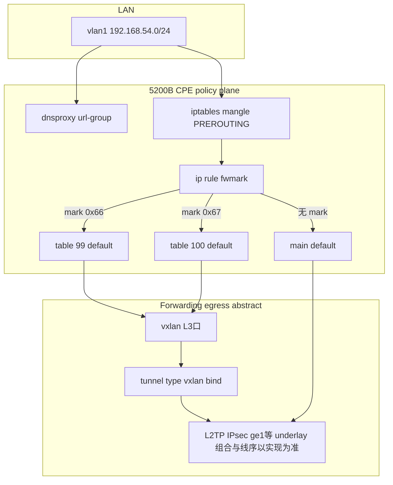

# Raisecom MSG5200B（5200B）系列：网络功能分析规则

> **定位**：产品特性规则，与 `src/sdwan_desktop/services/analyzer/rules/` 内可执行体检规则区分。  
> **配置样例**：`templates/whole_config_5200b.txt`  
> **解析实现线索**：`src/sdwan_desktop/services/parser/vendor/raisecom_msg5200b.py`（字段映射以 `spec/detail_function_design.md` 为准）。

---

## 1. 设备角色与分层模型

- **角色**：MSG5200-XGE-8E-G5（5200B）作为 **SD-WAN 跨境/直播分流业务的 CPE 终端网关**；内网为 `vlan1` `192.168.54.0/24`（DHCP），外网为 `ge1`（`serv-type internet`，注释说明 up 且获址时在 **main 表生成默认路由**）。
- **Underlay**：`ge1` 上联、`cell` 蜂窝；到 PoP 的 **L2TP**（`l2tpc0`/`l2tpc1` 对端 `36.133.95.200`/`202`）；在 L2TP 接口上叠 **IPsec transport**（`ipsec_tunnel49`/`50`，对端 `11.24.0.1` / `11.25.0.1`）。
- **Overlay（本例为「业务 vxlan 逻辑口 + tunnel type vxlan」一类）**：
  - `tunnel tunnel49/50`：`type vxlan`，声明 **VTEP 源/目的**（本模板与 **`l2tpc0`/`l2tpc1` 本端/对端地址** 同网段），与 **`vpn ipsec phase1` 绑定 `l2tpc0`/`1`** 并存，属于 **多机制组合 underlay**，不能从 running-config 唯一推出 **线路上 ESP / L2TP / UDP 4789 的严格先后**；**禁止**将 **`tunnel → l2tp → ipsec → ge1`** 画成唯一串联事实。
  - 四个 `vxlan*` **三层逻辑口**写 **`bind tunnel49`** 或 **`bind tunnel50`**：配置语义是 **FIB 先选中 `vxlan*` 作为三层面出接口**，**再由绑定的 `tunnel*` 完成 VXLAN 封装参数**；`tunnel` 是 **隧道实例/封装配置**，不是「夹在 l2tp 与 ipsec 之间的一层独立线序节点」。

**出向业务流（仅描述可配置断言部分）**：`vlan1` 用户 IP 包 →（`ip rule` → **table 99/100** 或 **main**）→ 命中策略时 **`ip route` 的 `dev` 为某个 `vxlan25xx/26xx`** → **经 `bind` 的 `tunnel49/50` 做 VXLAN 封装** → **之后进入何种 underlay（经 `l2tpc*`、是否经 IPsec、最终从 `ge1`/`cell` 发出）由 RCIOS 转发实现决定**，应以 **厂商文档或对 WAN 口抓包** 为准。未命中策略的流量走 **`main` 默认路由 `dev ge1`**，不选上述 `vxlan*`。

**table 99 / 100 与 vxlan 口**：**99** → `vxlan2500133` / `vxlan2600131`（跨境主备）；**100** → `vxlan2500176` / `vxlan2600170`（直播主备）；分别 `bind tunnel49` 或 `tunnel50`，**策略面相同**，仅出接口与 VTEP 对不同。

### 1.1 常见 overlay / underlay 组合（通用，不限于本模板）

| 形态 | 配置/特征要点 | 与本模板关系 |
|------|----------------|----------------|
| **单 VXLAN** | 仅 `tunnel type vxlan` + `vxlan* bind`；VTEP 常为 **WAN 直连接口地址**；无 L2TP/IPsec | 本模板 **未采用**（另有 L2TP/IPsec） |
| **单 IPsec** | 仅 `phase1/phase2` + `ipsec enable`；出口多为 **VTI/route-based** 或 **policy 加密流**；无 VXLAN 业务口 | 本模板 **另有** VXLAN，不单 IPsec |
| **VXLAN over IPsec** | VTEP 或对端在 **加密域内**；或 **tunnel 源/peer 走 IPsec 保护子网** | 与「**IPsec 绑在 `l2tpc*`**」的叠法可能不同，需按具体版本文档区分 |
| **VXLAN over L2TP** | L2TP 分配 **点对点地址**，VXLAN **source/peer 落在该地址空间** | 本模板 **符合** VTEP 与 `l2tpc*` 同空间 |
| **VXLAN over L2TP + IPsec** | 同时存在 **l2tp-group**、**ipsec set interface l2tpc***、**tunnel type vxlan** | 本模板 **属于该组合**；**不在此文档中断言** ESP 与 L2TP 封装相对顺序 |

**结论**：`whole_config_5200b.txt` 只证明 **策略选路落在 `vxlan*`、`bind` 到 `tunnel type vxlan`、且与 L2TP/IPsec 共存**；**不**将某一固定线序写入为事实。诊断应 **分场景核对**：是否有 `l2tp-group`、IPsec **interface**、VXLAN **source/peer** 落在哪类地址上，再决定是否需要 WAN 抓包或查 RCIOS 说明。

---

## 2. Overlay 与业务维度的对应关系

配置中 **两条隧道 × 每业务主备两条 VXLAN 子接口**，与 `url-group` 的 **nexthop master/backup** 一一对应：

| 业务 url-group | DNS 探针（驱动解析） | Master 下一跳 / VXLAN | Backup 下一跳 / VXLAN |
|----------------|----------------------|------------------------|------------------------|
| `acceleratePlus`（跨境） | `8.8.8.8` | `5.96.1.26` → `vxlan2500133`（bind tunnel49） | `5.100.1.18` → `vxlan2600131`（bind tunnel50） |
| `liveBroadcast`（直播） | `8.8.4.4` | `5.96.1.198` → `vxlan2500176` | `5.100.1.174` → `vxlan2600170` |

- **FIB 静态路由**：对 `8.8.8.8/32`、`8.8.4.4/32`、`5.96.1.192/30` 等在 **default VRF** 下配置了 **metric 5（主）与 metric 8（备）** 两条下一跳，与 `show ip route` 中带 `*>` 的主选、`S` 的备选一致，用于 **DNS 探测走指定 overlay 路径**。
- **link-detect + link-protect**：对四个 VXLAN 口向各自 **ipv4-dest** 做 ping，`link-protect protect route` 在故障时 **switch master**，与策略表里 **metric 10/20 双默认路由** 共同构成 **接口级主备**。

---

## 3. 「策略路由」在本机上的真实实现：fwmark + 多路由表

诊断 shell 输出是核心依据：

- **`ip rule`**：`fwmark 0x67` → `lookup 100`，`fwmark 0x66` → `lookup 99`，再经 `lookup 220`、`main` 等。即 **命中标记后走独立默认路由表**（典型 Linux policy routing）。
- **`ip route show table 99/100`**：各表两条 **默认路由**，master 经 metric 10 的 VXLAN，backup 经 metric 20 的另一 VXLAN，与 overlay 主备设计一致。
- **报文标记来源**：`iptables -t mangle -L` 显示在 **PREROUTING** 根据 **ipset** 做源/目的匹配后 `MARK set 0x66` 或 `0x67`。

因此本例中「策略路由命中」应理解为：**（源 IP 白名单 ∧ 目的 IP 属于业务解析集）→ MARK → ip rule 选表 → 该表默认走指定 overlay 主备链**；未匹配则仍走 **main**（示例中为 `D>* 0.0.0.0/0` 经 `ge1`）。

---

## 4. 命中逻辑详解（顺序与条件）

### 4.1 DNS → ipset（「业务目的」如何进内核）

- `plugin install urlaccelerate` 下两个 `url-group`：`acceleratePlus`（注释：**DNS 命中后报文标记 0x66**）、`liveBroadcast`（**0x67**）。
- 配置项 **`dns server`** 指向不同公共 DNS，**优先级高于本地 DNS**，使 **不同业务域名解析走不同探测路径**，从而把解析得到的 **目的 IP** 写入不同 ipset。
- **`url match suffix`**：后缀匹配域名列表。
- **`security ip enable` + `source ip`**：仅允许名单内源 IP 参与策略；**同一终端在两组中可并存，真正分流由目的 ipset + 规则顺序决定**。

### 4.2 iptables PREROUTING 顺序（与 url-group priority 对齐）

参见 `templates/whole_config_5200b.txt` 中 mangle 段（约 L920–L942）：

1. **第一条**：`security_ip_list_liveBroadcast` **src** 且 `url_white_list_liveBroadcast` **dst** → 跳转到 **`MASK_AND_STOP_liveBroadcast`**：`MARK set 0x67` 后 **`ACCEPT`**（命中直播后不再被后续规则改写）。
2. **第二条**：`security_ip_list_acceleratePlus` **src** 且 `url_white_list_acceleratePlus` **dst** → **`MARK set 0x66`**。

与配置中 **`liveBroadcast` priority 高于 `acceleratePlus`** 一致：若某目的 IP 同时落在两组解析集中（极端或 CDN 重叠），**PREROUTING 上直播规则在前**，优先 **0x67** → **`lookup 100`**。

### 4.3 `ip rule` 优先级

输出中 **218（0x67）在 219（0x66）之前**，与「直播优先」策略一致；一般单流只会带一种 mark。

### 4.4 主备下一跳在「策略表」内的选择

- Table **99**（0x66）：`default via 5.96.1.26 dev vxlan2500133 metric 10`，`default via 5.100.1.18 dev vxlan2600131 metric 20`。
- Table **100**（0x67）：`default via 5.96.1.198 dev vxlan2500176 metric 10`，`default via 5.100.1.174 dev vxlan2600170 metric 20`。

**主备选择**：同一表内 **metric 更小者优先**；overlay 故障时 **link-protect** 与 **nqa/dns-detect** 可参与 **underlay 或探测切换**。

---

## 5. NAT 与转发路径注意点

- `ip nat source`：`ge1`、`l2tpc0`、`l2tpc1` 上分别做源 NAT，说明 **直连 Internet 与两条 L2TP 隧道** 均可能作为非策略流量出口。
- 策略流量经 **VXLAN 子接口** 出站时，走 **table 99/100 的默认路由**，与 **main 表默认路由** 分离。

### 5.1 与 CPE 侧 nf_conntrack 采样的关系（实现必读）

- 拓扑后探测对 **业务目的 IP** 做 `nf_conntrack | grep`（见 `services/probe/planner.py` 头注释）：**不是**按 PC 源 grep。
- **PC → 上游路由/NAT → CPE** 时，CPE 上常见 **看不到 PC 私网源**；**零命中或源地址与 PC 快照不一致** 不能单独推出「NAT 规则未命中」或「策略路由整体未生效」，须与隧道 ICMP、会话形态及 Overlay 证据链对账（见 `RootCauseEngine` 与 `joint_commercial_delivery` 相关逻辑）。
- **报告呈现**：当隧道探针与会话形态支持「对端以远」结论时，根因卡片 **标题** 须与正文对账一致，**不得**继续沿用绝对化用语「策略路由未生效」作为 CPE-003 标题（见引擎内对 `CPE-003`/`CPE-004` 的标题改写逻辑）。

### 5.2 联合业务诊断：会话与隧道判定（5200B-only）

> **完整真值表、D0 硬否决、url-group 多组优先级**：见专章 [**raisecom_msg5200b_business_joint_gate.md**](raisecom_msg5200b_business_joint_gate.md)（**仅 5200B**；其他型号禁止套用）。  
> **三条流与分层拓扑（跨厂商）**：见 [`THREE_FLOWS_PRODUCT_POSITIONING.md`](../THREE_FLOWS_PRODUCT_POSITIONING.md)。

以下摘要与 [**business_joint_gate.md**](raisecom_msg5200b_business_joint_gate.md) **L0–L5 分层**一致；实现见 `raisecom_msg5200b_path_verdict.py`（聚合）及 `raisecom_msg5200b_session_path.py`（L1）。

| 层/档位 | 条件（摘要） | 隧道 / Overlay | 拓扑 cpe→hub |
|---------|--------------|----------------|--------------|
| **L1 会话** | 单行：正向 `dst`=业务 IP 且回程经 **vxlan 口/隧道下一跳**；或 blob 全 DIP 隧道（策略源未匹配） | **精确定位**，展示 | 展示 |
| **L2+L3** | ipset/rule（+iptables 计数）且 FIB 出 **vxlan\*** | **精确定位**，展示 | 展示 |
| **D1 策略源** | PC 匹配 SD-WAN 策略 `source` 前缀（L1 未短路时） | **精确定位**，展示 | 展示 |
| **L5 / D3** | traceroute 命中 overlay 邻接集 | **启发式**，展示 | 展示 |
| **Underlay** | 有会话但 L1–L3/L5 均不成立 | **不**展示 Overlay | 不展示 |
| **url-group** | 多组 + priority（§4.2） | **仅补充**叙述，**不**单独打开 Overlay | 服从上表 |
| **无会话** | nf_conntrack 对声明目的 **无有效行** | 未表现为经本设备转发 | 不展示 |

**废除**：「全部 DIP 公网 → 硬否决 Overlay」（原 D0）。

非 5200B CPE：**仅当** PC 侧 traceroute 跳表命中隧道/Overlay 相关地址时展示隧道示意条；仅有 conntrack 命中公网目的 IP 或「已出站到公网」路径旁证 **不**展示 Overlay（见专章 §6）。

### 5.3 HTML 联合报告呈现约定（5200B 联合报告适用）

> **跨厂商 UX 细则**（证据完整、结论简洁分区表）：[`BUSINESS_DIAGNOSE_REPORT_UX.md`](../BUSINESS_DIAGNOSE_REPORT_UX.md)。

- **根因分析**：每条根因须 **描述清晰**，证据引用与正文须形成 **完整证据链**（含 conntrack 原始键、策略与 PC 快照对照等）。
- **页首结论 / 交付摘要 / 路径实证首屏**：**简洁**（见 REPORT_UX）；**禁止** 堆叠 url-group 全文或与门控矛盾的 conntrack 用语。
- **启发式与 5200B D3/D5** 的长说明放在 **根因卡片** 与 **证据链** 折叠区，与 §5.2 分工一致。
- **分层拓扑**：Underlay 路径形态 **始终** 保留；Overlay + cpe→hub **同门控**（`show_business_flow_overlay`），见 [`THREE_FLOWS_PRODUCT_POSITIONING.md`](../THREE_FLOWS_PRODUCT_POSITIONING.md) §3。

---

## 6. 小结：排查「没走加速/走错链路」时应看的条件链

1. 终端 IP 是否在 **`security_ip_list_*`**（与 `url-group` 的 `security ip` 一致）。
2. 目的 IP 是否落在 **`url_white_list_*`**（DNS 是否经对应 **8.8.8.8 / 8.8.4.4** 解析成功、ttl 是否过期）。
3. **`iptables -t mangle` 计数**是否增长（PREROUTING 两条规则及 `MASK_AND_STOP` 子链）。
4. **`ip rule` + `ip route show table 99/100`** 是否与当前主备链路一致；**`show link-protect status`** 当前 action 口是否为 master VXLAN。

---

## 7. 文档维护

- 模板或现网有重大变更时，同步更新本文与 `templates/whole_config_5200b.txt` 交叉引用。  
- Cursor 侧计划草案见：`.cursor/plans/5200b_overlay_pbr_analysis_223a7080.plan.md`（易错点回顾以计划文件「近期实现易错点」章节为准，并定期合并回本文 §5 或独立 FAQ）。
