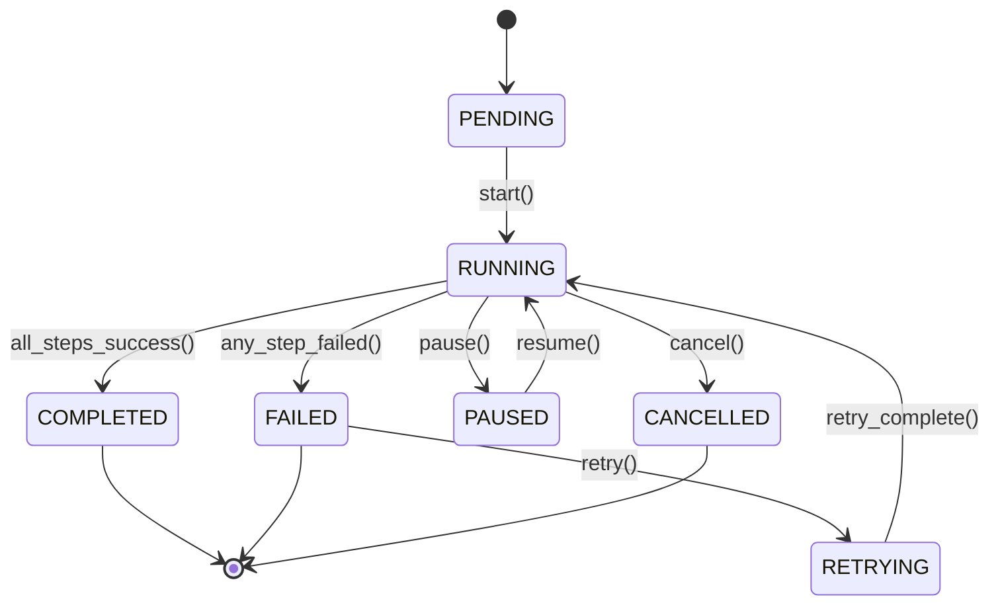
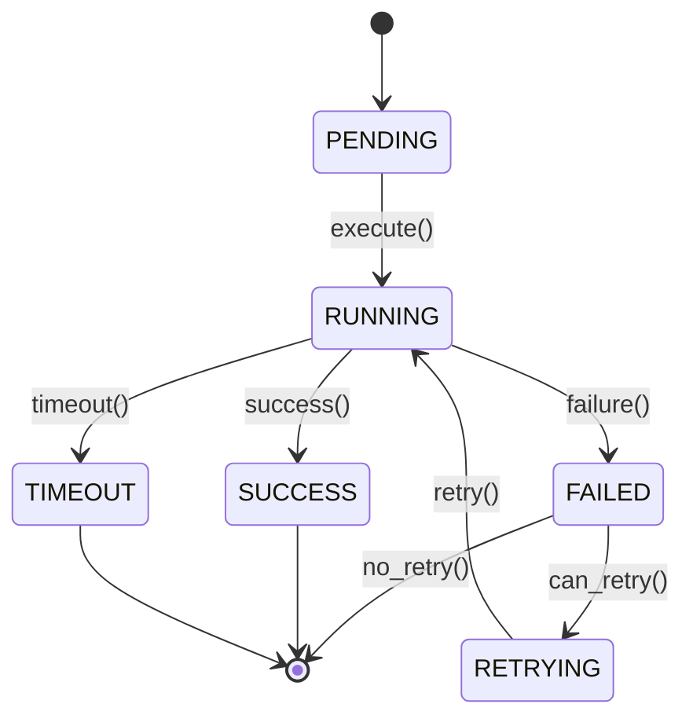

# 状态上下文规范

## 概述
本规范定义SD-WAN诊断平台的状态管理和上下文传递机制，包括流程状态、步骤快照、上下文对象和状态迁移规则。

## 核心概念

### FlowStatus 枚举
流程状态定义：

```python
from enum import Enum

class FlowStatus(str, Enum):
    """流程状态枚举"""
    PENDING = "pending"      # 等待执行
    RUNNING = "running"      # 执行中
    COMPLETED = "completed"  # 完成
    FAILED = "failed"        # 失败
    CANCELLED = "cancelled"  # 取消
    PAUSED = "paused"        # 暂停
    RETRYING = "retrying"    # 重试中
```

### StepStatus 枚举
步骤状态定义：

```python
class StepStatus(str, Enum):
    """步骤状态枚举"""
    PENDING = "pending"      # 等待执行
    RUNNING = "running"      # 执行中
    SUCCESS = "success"      # 成功
    FAILED = "failed"        # 失败
    SKIPPED = "skipped"      # 跳过
    TIMEOUT = "timeout"      # 超时
    RETRYING = "retrying"    # 重试中
```

## 数据结构

### StepSnapshot
步骤执行快照：

```python
from dataclasses import dataclass, field
from typing import Optional, Dict, Any
from datetime import datetime

@dataclass(slots=True)
class StepSnapshot:
    """步骤执行快照"""
    # 标识信息
    step_id: str                    # 步骤唯一标识
    step_name: str                  # 步骤名称
    trace_id: str                   # 追踪ID
    
    # 状态信息
    status: StepStatus = StepStatus.PENDING  # 步骤状态
    retry_count: int = 0                     # 重试次数
    max_retries: int = 3                     # 最大重试次数
    
    # 时间信息
    start_time: Optional[datetime] = None    # 开始时间
    end_time: Optional[datetime] = None      # 结束时间
    duration_ms: Optional[float] = None      # 执行时长（毫秒）
    
    # 数据信息
    input_data: Optional[Dict[str, Any]] = None      # 输入数据
    output_data: Optional[Dict[str, Any]] = None     # 输出数据
    error_data: Optional[Dict[str, Any]] = None      # 错误数据
    
    # 元数据
    created_at: datetime = field(default_factory=datetime.utcnow)  # 创建时间
    updated_at: datetime = field(default_factory=datetime.utcnow)  # 更新时间
    
    def is_completed(self) -> bool:
        """检查步骤是否完成"""
        return self.status in [StepStatus.SUCCESS, StepStatus.FAILED, StepStatus.SKIPPED]
    
    def is_successful(self) -> bool:
        """检查步骤是否成功"""
        return self.status == StepStatus.SUCCESS
    
    def can_retry(self) -> bool:
        """检查是否可以重试"""
        return self.status == StepStatus.FAILED and self.retry_count < self.max_retries
```

### FlowContext
流程执行上下文：

```python
from dataclasses import dataclass, field
from typing import Dict, Any, List, Optional
import uuid

@dataclass(slots=True)
class FlowContext:
    """流程执行上下文"""
    # 标识信息
    flow_id: str = field(default_factory=lambda: str(uuid.uuid4()))  # 流程ID
    flow_name: str                                                   # 流程名称
    trace_id: str = field(default_factory=lambda: str(uuid.uuid4())) # 追踪ID
    
    # 状态信息
    status: FlowStatus = FlowStatus.PENDING          # 流程状态
    current_step_index: int = 0                      # 当前步骤索引
    error_count: int = 0                             # 错误计数
    
    # 数据存储
    data: Dict[str, Any] = field(default_factory=dict)      # 共享数据
    steps: List[StepSnapshot] = field(default_factory=list) # 步骤快照列表
    metadata: Dict[str, Any] = field(default_factory=dict)  # 元数据
    
    # 配置信息
    config: Dict[str, Any] = field(default_factory=dict)    # 流程配置
    timeout_seconds: int = 300                              # 超时时间（秒）
    
    # 时间信息
    created_at: datetime = field(default_factory=datetime.utcnow)  # 创建时间
    started_at: Optional[datetime] = None                          # 开始时间
    completed_at: Optional[datetime] = None                        # 完成时间
    
    def add_step(self, step: StepSnapshot) -> None:
        """添加步骤快照"""
        self.steps.append(step)
        self.current_step_index = len(self.steps) - 1
    
    def get_current_step(self) -> Optional[StepSnapshot]:
        """获取当前步骤"""
        if self.steps and 0 <= self.current_step_index < len(self.steps):
            return self.steps[self.current_step_index]
        return None
    
    def get_step_by_id(self, step_id: str) -> Optional[StepSnapshot]:
        """根据ID获取步骤"""
        for step in self.steps:
            if step.step_id == step_id:
                return step
        return None
    
    def get_step_by_name(self, step_name: str) -> List[StepSnapshot]:
        """根据名称获取步骤"""
        return [step for step in self.steps if step.step_name == step_name]
    
    def set_data(self, key: str, value: Any) -> None:
        """设置共享数据"""
        self.data[key] = value
    
    def get_data(self, key: str, default: Any = None) -> Any:
        """获取共享数据"""
        return self.data.get(key, default)
    
    def has_data(self, key: str) -> bool:
        """检查是否存在共享数据"""
        return key in self.data
    
    def is_completed(self) -> bool:
        """检查流程是否完成"""
        return self.status in [FlowStatus.COMPLETED, FlowStatus.FAILED, FlowStatus.CANCELLED]
    
    def is_successful(self) -> bool:
        """检查流程是否成功"""
        return self.status == FlowStatus.COMPLETED
    
    def get_duration_ms(self) -> Optional[float]:
        """获取流程执行时长"""
        if self.started_at and self.completed_at:
            return (self.completed_at - self.started_at).total_seconds() * 1000
        return None
```

## 状态迁移规则

### 流程状态迁移


### 步骤状态迁移


## 上下文管理

### 上下文创建
```python
def create_context(
    flow_name: str,
    config: Optional[Dict[str, Any]] = None,
    initial_data: Optional[Dict[str, Any]] = None
) -> FlowContext:
    """创建流程上下文"""
    context = FlowContext(
        flow_name=flow_name,
        config=config or {},
        data=initial_data or {}
    )
    return context
```

### 上下文序列化
```python
import json
from datetime import datetime
from typing import Any

def serialize_context(context: FlowContext) -> str:
    """序列化上下文为JSON字符串"""
    
    def default_serializer(obj: Any) -> Any:
        """自定义序列化器"""
        if isinstance(obj, datetime):
            return obj.isoformat()
        if isinstance(obj, (FlowStatus, StepStatus)):
            return obj.value
        if hasattr(obj, 'to_dict'):
            return obj.to_dict()
        raise TypeError(f"Object of type {type(obj)} is not JSON serializable")
    
    return json.dumps(context, default=default_serializer, indent=2)

def deserialize_context(json_str: str) -> FlowContext:
    """从JSON字符串反序列化上下文"""
    data = json.loads(json_str)
    
    # 重建上下文对象
    context = FlowContext(
        flow_id=data.get('flow_id', str(uuid.uuid4())),
        flow_name=data['flow_name'],
        trace_id=data.get('trace_id', str(uuid.uuid4())),
        status=FlowStatus(data['status']),
        current_step_index=data.get('current_step_index', 0),
        error_count=data.get('error_count', 0),
        data=data.get('data', {}),
        metadata=data.get('metadata', {}),
        config=data.get('config', {}),
        timeout_seconds=data.get('timeout_seconds', 300)
    )
    
    # 重建步骤快照
    for step_data in data.get('steps', []):
        step = StepSnapshot(
            step_id=step_data['step_id'],
            step_name=step_data['step_name'],
            trace_id=step_data.get('trace_id', context.trace_id),
            status=StepStatus(step_data['status']),
            retry_count=step_data.get('retry_count', 0),
            max_retries=step_data.get('max_retries', 3),
            input_data=step_data.get('input_data'),
            output_data=step_data.get('output_data'),
            error_data=step_data.get('error_data')
        )
        context.steps.append(step)
    
    return context
```

## 状态持久化

### 持久化策略
1. **内存存储**：运行时状态，重启丢失
2. **文件存储**：JSON文件，用于调试和回放
3. **数据库存储**：生产环境，支持查询和分析

### 存储接口
```python
from abc import ABC, abstractmethod
from typing import Optional

class ContextStorage(ABC):
    """上下文存储接口"""
    
    @abstractmethod
    def save(self, context: FlowContext) -> str:
        """保存上下文，返回存储ID"""
        pass
    
    @abstractmethod
    def load(self, storage_id: str) -> Optional[FlowContext]:
        """加载上下文"""
        pass
    
    @abstractmethod
    def delete(self, storage_id: str) -> bool:
        """删除上下文"""
        pass
    
    @abstractmethod
    def list(self, filter_criteria: Optional[Dict[str, Any]] = None) -> List[str]:
        """列出上下文ID"""
        pass
```

### 文件存储实现
```python
import os
import json
from pathlib import Path

class FileContextStorage(ContextStorage):
    """文件存储实现"""
    
    def __init__(self, storage_dir: str = "./context_storage"):
        self.storage_dir = Path(storage_dir)
        self.storage_dir.mkdir(parents=True, exist_ok=True)
    
    def save(self, context: FlowContext) -> str:
        """保存到文件"""
        storage_id = f"{context.flow_id}.json"
        file_path = self.storage_dir / storage_id
        
        with open(file_path, 'w', encoding='utf-8') as f:
            f.write(serialize_context(context))
        
        return storage_id
    
    def load(self, storage_id: str) -> Optional[FlowContext]:
        """从文件加载"""
        file_path = self.storage_dir / storage_id
        
        if not file_path.exists():
            return None
        
        with open(file_path, 'r', encoding='utf-8') as f:
            json_str = f.read()
        
        return deserialize_context(json_str)
    
    def delete(self, storage_id: str) -> bool:
        """删除文件"""
        file_path = self.storage_dir / storage_id
        
        if file_path.exists():
            file_path.unlink()
            return True
        return False
    
    def list(self, filter_criteria: Optional[Dict[str, Any]] = None) -> List[str]:
        """列出所有文件"""
        files = list(self.storage_dir.glob("*.json"))
        return [f.name for f in files]
```

## 状态恢复与回放

### 状态恢复
```python
def restore_context(
    storage_id: str,
    storage: ContextStorage
) -> Optional[FlowContext]:
    """恢复上下文"""
    context = storage.load(storage_id)
    
    if context and context.status == FlowStatus.RUNNING:
        # 重置为可恢复状态
        context.status = FlowStatus.PAUSED
    
    return context
```

### 流程回放
```python
def replay_flow(
    context: FlowContext,
    from_step: Optional[int] = None
) -> FlowContext:
    """回放流程"""
    
    # 创建新的上下文用于回放
    replay_context = FlowContext(
        flow_id=f"replay_{context.flow_id}",
        flow_name=f"Replay: {context.flow_name}",
        trace_id=str(uuid.uuid4()),
        config=context.config.copy(),
        data=context.data.copy(),
        metadata={
            "original_flow_id": context.flow_id,
            "original_trace_id": context.trace_id,
            "replay_from_step": from_step
        }
    )
    
    # 复制步骤快照（只读）
    for step in context.steps:
        replay_context.steps.append(step)
    
    return replay_context
```

## 最佳实践

### 1. 上下文设计原则
- **最小化共享数据**：只共享必要的数据
- **明确数据所有权**：每个步骤明确输入输出
- **避免循环依赖**：数据流应该是单向的
- **支持序列化**：所有数据必须可序列化

### 2. 状态管理原则
- **状态原子性**：状态变更应该是原子的
- **状态可追溯**：每个状态变更都应该有记录
- **状态可恢复**：支持从失败状态恢复
- **状态一致性**：确保状态与数据一致

### 3. 性能考虑
- **内存优化**：避免在上下文中存储大对象
- **序列化优化**：使用高效的序列化格式
- **存储分层**：根据访问频率选择存储策略
- **缓存策略**：对频繁访问的数据进行缓存

## 版本控制
- 初始版本：1.0.0
- 变更记录：见CHANGELOG.md