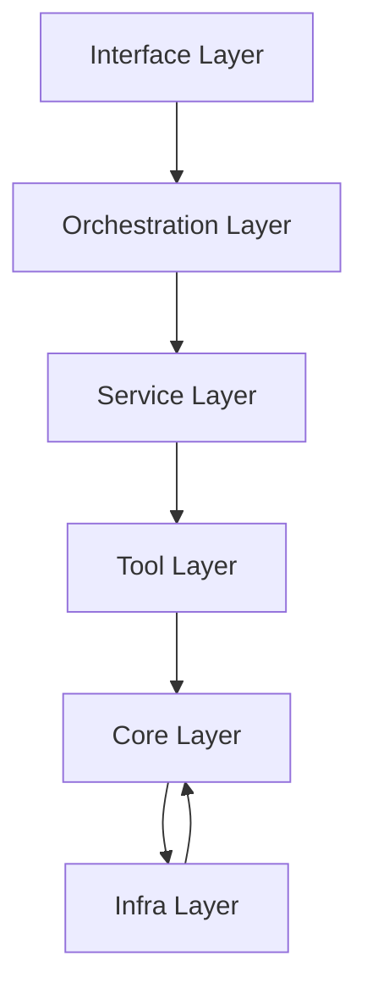

# 分层架构模型规范

## 概述
本规范定义SD-WAN诊断平台的分层架构模型，包括各层的职责、依赖关系、接口契约和交互模式。

## 架构分层

### 六层架构模型
SD-WAN诊断平台采用六层架构模型，确保关注点分离和模块化设计：



### 各层详细说明

#### 1. Interface Layer（接口层）
**职责**：外部交互接口，包括CLI、API、GUI等入口点。

**功能**：
- 接收外部输入并验证参数
- 组装标准化 `AgentInput` 对象
- 调用编排层执行诊断流程
- 渲染输出结果（JSON、HTML、CLI表格等）

**禁止**：
- 承载业务逻辑
- 直接调用工具实现细节
- 维护运行时状态

**典型组件**：
- CLI入口（agentctl）
- REST API服务器
- GUI主窗口
- WebSocket接口

#### 2. Orchestration Layer（编排层）
**职责**：流程编排、状态管理、任务调度。

**功能**：
- 基于Flow定义调度步骤执行
- 管理流程状态和上下文
- 处理分支决策和条件执行
- 实现重试、回放和错误恢复机制

**禁止**：
- 直接实现业务算法
- 包含底层IO操作
- 硬编码流程逻辑

**典型组件**：
- Flow执行引擎
- DAG调度器
- 状态机管理器
- 任务队列

#### 3. Service Layer（服务层）
**职责**：业务逻辑实现，领域服务。

**功能**：
- 实现诊断业务规则
- 处理领域对象和聚合
- 调用工具层获取数据
- 执行数据分析和转换

**禁止**：
- 直接访问外部系统
- 包含流程编排逻辑
- 耦合基础设施细节

**典型组件**：
- 诊断分析服务
- 拓扑构建服务
- 根因分析引擎
- 报告生成服务

#### 4. Tool Layer（工具层）
**职责**：外部工具封装，统一接口适配。

**功能**：
- 封装网络探测工具（ping、traceroute、DNS等）
- 提供统一的 `ToolRequest/ToolResponse` 接口
- 实现超时、重试、错误映射
- 管理工具生命周期和资源

**禁止**：
- 包含业务决策逻辑
- 依赖服务层或编排层
- 暴露底层实现细节

**典型组件**：
- 网络探测工具
- 系统信息采集工具
- SSH/Telnet适配器
- 浏览器自动化工具

#### 5. Core Layer（核心层）
**职责**：基础数据契约、类型定义、常量。

**功能**：
- 定义系统核心数据模型
- 提供基础类型和枚举
- 定义错误码和异常体系
- 提供通用工具函数

**禁止**：
- 依赖任何上层模块
- 包含运行时逻辑
- 访问外部资源

**典型组件**：
- 数据契约定义
- 错误模型
- 常量定义
- 基础工具类

#### 6. Infra Layer（基础设施层）
**职责**：基础设施能力，跨领域支撑。

**功能**：
- 日志记录和追踪
- 配置管理和环境适配
- 数据持久化和缓存
- 安全和认证

**禁止**：
- 承载业务逻辑
- 耦合特定业务领域

**典型组件**：
- 日志系统
- 配置加载器
- 数据库适配器
- 安全认证模块

## 依赖关系规则

### 单向依赖规则
依赖方向必须遵循以下规则：

```
Interface → Orchestration → Service → Tool → Core
                                    ↑
                                 Infra → Core
```

### 具体约束

1. **Interface Layer** 可以依赖：
   - Orchestration Layer
   - Core Layer
   - Infra Layer（仅限日志、配置）

2. **Orchestration Layer** 可以依赖：
   - Service Layer
   - Tool Layer（通过Dispatcher）
   - Core Layer
   - Infra Layer

3. **Service Layer** 可以依赖：
   - Tool Layer（通过Dispatcher）
   - Core Layer
   - Infra Layer

4. **Tool Layer** 可以依赖：
   - Core Layer
   - Infra Layer（仅限基础设施）

5. **Core Layer** 禁止依赖任何其他层

6. **Infra Layer** 可以依赖：
   - Core Layer

### 禁止的依赖模式

```python
# ❌ 禁止：反向依赖
class ToolImplementation:
    def __init__(self):
        self.service = Service()  # 工具层依赖服务层

# ❌ 禁止：跨层直接调用
class InterfaceHandler:
    def handle(self):
        tool = PingTool()  # 接口层直接调用工具层
        tool.execute()

# ❌ 禁止：循环依赖
# LayerA → LayerB → LayerC → LayerA

# ✅ 正确：通过Dispatcher调用
class ServiceImplementation:
    def __init__(self, dispatcher: ToolDispatcher):
        self.dispatcher = dispatcher
    
    async def analyze(self):
        result = await self.dispatcher.dispatch("ping", request)
```

## 接口契约

### 层间接口标准

#### 1. Interface → Orchestration
```python
@dataclass
class AgentInput:
    """接口层到编排层的输入"""
    command: str
    parameters: Dict[str, Any]
    context: Dict[str, Any]
    trace_id: str

@dataclass
class AgentOutput:
    """编排层到接口层的输出"""
    success: bool
    data: Dict[str, Any]
    error: Optional[str]
    trace_id: str
```

#### 2. Orchestration → Service
```python
@dataclass
class ServiceRequest:
    """编排层到服务层的请求"""
    service_name: str
    method: str
    parameters: Dict[str, Any]
    context: FlowContext
    trace_id: str

@dataclass
class ServiceResponse:
    """服务层到编排层的响应"""
    success: bool
    result: Any
    error: Optional[str]
    trace_id: str
```

#### 3. Service → Tool (通过Dispatcher)
```python
@dataclass
class ToolRequest:
    """服务层到工具层的请求"""
    tool_name: str
    parameters: Dict[str, Any]
    context: Dict[str, Any]
    trace_id: str

@dataclass
class ToolResponse:
    """工具层到服务层的响应"""
    success: bool
    data: Any
    error: Optional[str]
    trace_id: str
    execution_time_ms: float
```

#### 4. 通用上下文对象
```python
@dataclass
class FlowContext:
    """流程上下文"""
    flow_id: str
    flow_name: str
    status: str
    data: Dict[str, Any]
    steps: List[StepSnapshot]
    config: Dict[str, Any]
    trace_id: str
    created_at: datetime
    updated_at: datetime
```

## 模块边界与包结构

### 包结构映射
```
src/sdwan_desktop/
├── interface/          # Interface Layer
├── runtime/           # Orchestration Layer
├── services/          # Service Layer
├── tools/             # Tool Layer
├── core/              # Core Layer
├── observability/     # Infra Layer - 可观测性
├── config/            # Infra Layer - 配置管理
└── bootstrap/         # 启动引导
```

### 模块导入规则

#### 允许的导入模式
```python
# ✅ 正确：向下层导入
from sdwan_desktop.core.types import BaseContract
from sdwan_desktop.runtime.engine import FlowEngine

# ✅ 正确：同层内导入
from sdwan_desktop.services.analyzer import TopologyBuilder
from sdwan_desktop.services.parser import ConfigParser

# ✅ 正确：通过抽象接口导入
from sdwan_desktop.tools.registry import ToolDispatcher
```

#### 禁止的导入模式
```python
# ❌ 禁止：向上层导入
from sdwan_desktop.interface.cli import CLIHandler  # 在服务层中

# ❌ 禁止：跨层直接导入实现
from sdwan_desktop.tools.implementations.ping import PingTool  # 在服务层中

# ❌ 禁止：循环导入
# module_a.py
from module_b import func_b

# module_b.py
from module_a import func_a
```

## 通信模式

### 同步通信
适用于简单、快速的交互：

```python
# 同步调用示例
class SyncOrchestrator:
    def execute(self, input_data: AgentInput) -> AgentOutput:
        # 验证输入
        validated = self._validate(input_data)
        
        # 调用服务
        service_result = self._call_service(validated)
        
        # 处理结果
        return self._build_output(service_result)
```

### 异步通信
适用于IO密集型、长时间运行的任务：

```python
# 异步调用示例
class AsyncOrchestrator:
    async def execute(self, input_data: AgentInput) -> AgentOutput:
        # 创建异步任务
        tasks = [
            self._call_service_async("analyzer", validated),
            self._call_service_async("collector", validated)
        ]
        
        # 并发执行
        results = await asyncio.gather(*tasks, return_exceptions=True)
        
        # 合并结果
        return await self._merge_results(results)
```

### 事件驱动通信
适用于松散耦合、响应式系统：

```python
# 事件驱动示例
class EventDrivenOrchestrator:
    def __init__(self, event_bus: EventBus):
        self.event_bus = event_bus
        
    async def execute(self, input_data: AgentInput) -> AgentOutput:
        # 发布开始事件
        await self.event_bus.publish("flow.started", {
            "flow_id": input_data.flow_id,
            "trace_id": input_data.trace_id
        })
        
        # 订阅结果事件
        result = await self.event_bus.subscribe_and_wait(
            "flow.completed",
            {"trace_id": input_data.trace_id},
            timeout=300
        )
        
        return result
```

## 错误处理与传播

### 错误传播规则
1. **工具层错误**：映射为 `ToolError`，包含原始错误信息
2. **服务层错误**：转换为业务错误码，保留上下文
3. **编排层错误**：记录步骤失败，决定重试或终止
4. **接口层错误**：转换为用户友好消息，保持trace_id

### 错误处理示例
```python
class LayeredErrorHandler:
    async def handle_tool_error(self, error: Exception, context: dict) -> ToolResponse:
        """处理工具层错误"""
        if isinstance(error, TimeoutError):
            return ToolResponse(
                success=False,
                error="Tool execution timeout",
                error_code="TOOL_TIMEOUT",
                context=context,
                trace_id=context.get("trace_id")
            )
        elif isinstance(error, ConnectionError):
            return ToolResponse(
                success=False,
                error="Connection failed",
                error_code="TOOL_CONNECTION_ERROR",
                context=context,
                trace_id=context.get("trace_id")
            )
        else:
            return ToolResponse(
                success=False,
                error=str(error),
                error_code="TOOL_UNKNOWN_ERROR",
                context=context,
                trace_id=context.get("trace_id")
            )
```

## 性能与扩展性考虑

### 性能优化策略
1. **缓存策略**：在适当层级实现缓存（如服务层缓存工具结果）
2. **并发控制**：在编排层控制并发度，避免资源耗尽
3. **懒加载**：延迟初始化重量级组件
4. **连接池**：在工具层管理网络连接池

### 扩展性设计
1. **插件架构**：工具层支持插件式扩展
2. **配置驱动**：通过配置调整各层行为
3. **水平扩展**：无状态服务层支持水平扩展
4. **垂直分层**：清晰的分层便于独立扩展

## 测试策略

### 分层测试
1. **单元测试**：每层内部组件独立测试
2. **集成测试**：测试层间接口契约
3. **端到端测试**：完整流程测试
4. **契约测试**：确保接口契约稳定性

### 测试替身策略
1. **工具层**：使用Mock模拟外部工具
2. **服务层**：使用Fake实现轻量级替代
3. **编排层**：使用Stub模拟服务响应
4. **接口层**：使用Test Client模拟用户输入

## 部署与运维

### 部署模式
1. **单体部署**：所有层打包为一个应用
2. **微服务部署**：各层作为独立服务部署
3. **混合部署**：关键层独立部署，其他层合并

### 监控指标
1. **接口层**：请求量、响应时间、错误率
2. **编排层**：流程执行时间、步骤成功率
3. **服务层**：业务指标、处理延迟
4. **工具层**：工具调用次数、成功率、延迟

## 迁移与演进

### 向后兼容
1. **接口契约**：保持向后兼容，使用版本控制
2. **数据模型**：支持旧版本数据格式
3. **配置格式**：兼容旧配置，提供迁移工具

### 渐进式迁移
1. **逐层迁移**：一次迁移一个层级
2. **特性开关**：使用开关控制新功能
3. **并行运行**：新旧实现并行运行，逐步切换